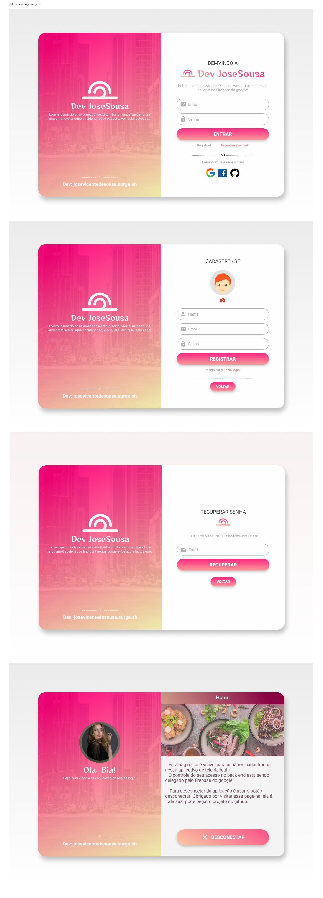

[JAVASCRIPT__BADGE]: https://img.shields.io/badge/Javascript-000?style=for-the-badge&logo=javascript
[TYPESCRIPT__BADGE]: https://img.shields.io/badge/typescript-D4FAFF?style=for-the-badge&logo=typescript
[FIREBASE__BADGE]: https://img.shields.io/badge/Firebase-F00?style=for-the-badge&logo=firebase
[ANGULAR__BADGE]: https://img.shields.io/badge/Angular-red?style=for-the-badge&logo=angular
[FIGMA__BADGE]: https://img.shields.io/badge/Figma-white?style=for-the-badge&logo=figma

<h1 align="center" style="font-weight: bold;">Tela Login </h1>

![angular][ANGULAR__BADGE]
![typescript][TYPESCRIPT__BADGE]
![javascript][JAVASCRIPT__BADGE]
![javascript][FIREBASE__BADGE]
![javascript][FIGMA__BADGE]

 <a href="#about">Sobre</a> 

    

<h2 id="about"> Sobre</h2>

Este repositório contém uma Tela de Login 'Tela-login' construída com Angular 17 no front end, firebase no back end, e figma na confecção do laytou. Em caso de alguma duvida na implementação pode entrar em contato comigo. Obrigado!

<a href="http://josevicentedesousa.surge.sh">http://josevicentedesousa.surge.sh</a>

